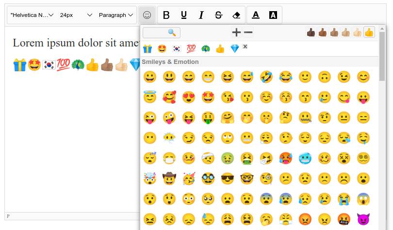

# suneditor-emojis

Add a Unicode Emojis submenu to the SunEditor toolbar. The plugin covers the entire 
Unicode standard and supports 'skin tone' where possible. Works with SunEditor releases from 2.35.0 to latest, you can test all versions in the link below : 

Demo ⇢ **https://suneditor-emojis.github.io**



The plugin comes with several useful features 

- Tests for local browser support, also trims out fallbacks; by that the browsers entire range is used 
without showing "odd" emojis

- A built-in cache speeds up loading and rendering 

## Download and Installation
Clone the repo into your project 
```bash
$ git clone https://github.com/davidkonrad/suneditor-emojis.git
```

Or download the zip file and uncompress it into your project directory.
## Include to your project
Include CSS and JavaScript from ```/dist``` :
```html
<link href="path/to/dist/suneditor-emojis.css" rel="stylesheet" type="text/css">
<script src="path/to/dist/suneditor-emojis.min.js"></script>
```
You can also import the plugin as a module, the ```.mjs```  version exports ```emojis``` 
```javascript
import { emojis } from './path/to/dist/suneditor-emojis.min.mjs'
```
## Use in SunEditor

Add ```emojis``` to SunEditors' ```plugins``` option, add a ```'emojis'``` button to ```buttonList```  
```javascript
const editor = SUNEDITOR.create('editor', {
  ...     
  plugins: [emojis],
  buttonList: ['emojis'],
  ...
})  
```
#### important
Add the following CSS rule to any page that shows text produced by SunEditor, but outside the SunEditor context, I.e "in production" 

```css
.se-emoji {
   font-family: "Noto Color Emoji", "Apple Color Emoji", "Segoe UI Emoji";
}
```

#### Version 3
SunEditor <a href="https://github.com/JiHong88/suneditor/tree/develop">v3.0.0</a> is coming! 
As soon as I figure out the new plugin layout and how to register custom plugins, I will make
a compatible version of this plugin as well. 
## Options
If needed the dropdown can be customised in various ways through the ```emojis``` option

```javascript
emojis: {
  groups: [array],
  captions: [array],
  showRecent: true,
  iconSize: 'string',
  skinTone: 'string',
  topmenu: {
    search: true,
    iconSize: true,
    skinTone: true
  },
  showFallbacks: false,
  tagName: 'span',
  width: 'string',
  height: 'string'
}
```
<hr>

#### groups

Specifies the kind of emojis to include in the dropdown. The emojis are ordered into their official <q>super</q> 
group names (see <a href="#about-unicode-emojis">About unicode emojis</a>). If ```groups``` are not set, all groups are included

```javascript
emojis: {
  groups: ['Smileys & Emotion', 'Activities', 'Animals & Nature', 'Flags', 
      'Food & Drink', 'Objects', 'People & Body', 'Symbols', 'Travel & Places']
  }       
}
```
<hr>

#### captions
Group captions. By default the same as the group names. Use names as localization of emoji group names. Here an example of group captions in spanish 
```javascript
emojis: {
  captions: ['Sonrisas y emociones', 'Actividades', 'Animales y naturaleza', 'Banderas',	
      'Comida y bebida', 'Objetos', 'Personas y cuerpo', 'Símbolos', 'Viajes y lugares']
}
```
💡 An empty string ```''``` in the array means the header should not be shown

💡 If you pass ```captions: false``` all emojis are shown continuously after each other without breaking headers

<hr>

#### showRecent
When ```true``` clicked emojis are remembered (in ```localStorage```) and shown as first choice in the dropdown

```javascript
emojis: {
  showRecent: true
}
```

<hr>

#### iconSize
The ```font-size``` of emojis shown in groups or by search

```javascript
emojis: {
  iconSize: '1.5rem'
}
```

💡 You can also enable ```topmenu.iconSize``` and let the user choose the size for themselves.


<hr>

#### skinTone 🖖 🖖🏻 🖖🏼 🖖🏽 🖖🏾 🖖🏿
Some ```'People & Body'``` emojis can be styled with six different 'skintones': 
```'neutral'```, ```'light'```, ```'mediumLight'```, ```'medium'```, ```'mediumDark'```, 
```'dark'```. 

```javascript
emojis: {
  skinTone: 'neutral'
}
```

💡 You can also enable ```topmenu.skinTone``` and let the user choose a skintone for themselves.

<hr>

#### topmenu
Adds a semi transparent header to the dropdown containing user controls

```javascript
emojis: {
  topmenu: {
    search: true,
    iconSize: true,
    skinTone: true
  }
}
```

```search``` enables a tiny input form,where you can filter out emojis by their names.

<hr>

#### tagName
While not strictly necessary it is recommended to wrap emojis into a HTML tag like ```<span>```. 

Most unicode emojis are displayed fine in HTML and in mixed text millieus, but the display can be suppressed
if the current DOM font-family also support the unicode themselves. For example 
"smiling face" 
may be substituted with  when using a helvetica font familiy.

By wrappping emojis into a tag we are sure they are rendered using a correct font family: 
```"Noto Color Emoji"```, ```"Apple Color Emoji"``` or ```"Segoe UI Emoji"```.


```javascript
emojis: {
  tagName: 'span'
}
```

<hr>

#### showFallbacks
Newer emojis may have a fallback that the browser can show as substitute if the unicode is not supported.
Those will often be rendered as two emojis side by side, like 🍄 🟫 as fallback for 
"Brown Mushroom", introduced in v15.1. The plugin hide fallbacks by default, but you can enable them by setting ```showFallbacks``` to true.

```javascript
emojis: {
  showFallbacks: false
}
```

<hr>

#### width, height
The SunEditor submenu dropdown will automatically fit the screen height and edge with the editor. 
You may want to reduce the height of the dropdown or increase the width. 

```javascript
emojis: {
  width: '50rem',
  height: '30rem'
}
```

<a id="about-uniocode-emojis"></a>

## About unicode emojis

As suggested above the emojis are ordered into 9 <q>super</q> groups :

| # | group | emojis (v17.0)
--- | --- | --- | 
😀 | 'Smileys & Emotion' | 171
🎯 | 'Activities' | 85
🦓 | 'Animals & Nature' | 160
🇩🇰 | 'Flags' | 270
🍷 | 'Food & Drink' | 131
👑 | 'Objects' | 266
👍 | 'People & Body' | 388
🚫 | 'Symbols' | 224
🚀 | 'Travel & Places' | 219

No browser or reader will ever support the entire scope of unicode, and will never implement
each and every unicode emoji <q><em>correct</em></q> or as <em>intended</em>. So the plugin will only be able 
to display those emojis the local browser support. The plugin automatically detects not supported emojis as well as emojis relying on fallbacks; see the ```showFallbacks``` option to enable browser fallbacks.

The website <a href="https://emojipedia.org">emojipedia.org</a> has detailed insight about the major browsers (and their platforms) support of emojis over time :

| platform | url | installed font
--- | --- | --- |
chrome | https://emojipedia.org/google | Noto Color Emoji
windows | https://emojipedia.org/microsoft | Segoe UI Emoji
apple | https://emojipedia.org/apple | Apple Color Emoji

## Credits
Suneditor-emojis is a plugin made for the excellent <b>SunEditor</b> wysiwyg editor https://github.com/JiHong88/suneditor.

Thanks to <b>unicode-emoji-json</b>, https://github.com/muan/unicode-emoji-json, who have made a script that parses unicode-docs into useful JSON.


## License
Suneditor-emojis is released under MIT license. You are free to use, modify and distribute this software, as long as the copyright header is left intact.


