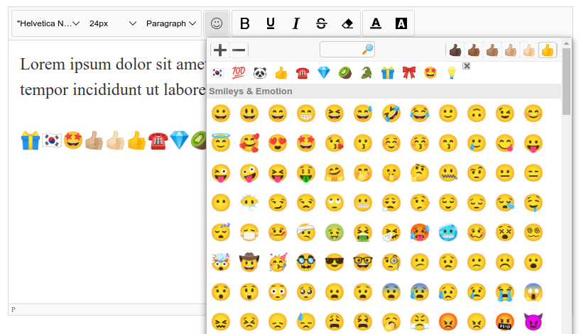

# suneditor-emojis

Add a unicode emojis submenu to the SunEditor toolbar. It comes with several useful features :




- Test for local browser support; only emojis the browser actually supports are shown. By that any possible emoji are shown, except those the browser for some reason is unable to render (for example because it is an older browser)

- A built-in cache speeds up loading and rendering 

- Follows <b>unicode-emoji-json</b>, <a href="https://github.com/muan/unicode-emoji-json">https://github.com/muan/unicode-emoji-json</a>, 
but are using a local version trimmed by 75% (less than 100k). By that the plugin are updated according to the latest version of the unicode standard (currently 16.0). 

## Usage
Include JS and CSS :
```html
<script src="suneditor-emojis.js"></script>
```
Now add ```emojisPlugin``` to the ```plugins``` option, and add the ```emojis``` button to ```buttonList``` : 
```javascript
const editor = SUNEDITOR.create('editor', {
  ...     
  plugins: [emojisPlugin],
  buttonList: [
    ['emojis']
  ],
  ...
})  
```

## options
You may want to alter the defaults, change settings by an ```emojis``` option :
```javascript
emojis: {
  groups: <array of strings>,
  names: <array of strings>,
  favorites: <bool>,
  iconSize: <string>,
  skinTone: <string>,
  topmenu: {
    search: <bool>,
    iconSize: <bool>,
    skinTone: <bool>
  }
  showFallbacks: <bool>,
  width: <string>,
  height: <string>
}
```

### groups

Specify the type of emojis to include in the dropdown. 
Below is an overview of the different groups and their number of emojis :

| # | group | emojis (v16.0)
--- | --- | --- | 
😀 | ```'Smileys & Emotion'``` | 169
🎯 | ```'Activities'``` | 85
🦓 | ```'Animals & Nature'``` | 159
🇩🇰 | ```'Flags'``` | 270
🍷 | ```'Food & Drink'``` | 131
👑 | ```'Objects'``` | 264
👍 | ```'People & Body'``` | 386
🚫 | ```'Symbols'``` | 224
🚀 | ```'Travel & Places'``` | 218

Since this is based on the latest version of the unicode standard, no browser is able to render all emojis correct. 
There are differences between the major browsers, and browsers are always behind the standard.  If ```groups``` 
are not set all groups are included.

```javascript
emojis: {
  groups: ['Smileys & Emotion',  'Activities', 'Animals & Nature', 'Flags', 
      'Food & Drink', 'Objects', 'People & Body', 'Symbols', 'Travel & Places']
  }       
}
```

### names

### favorites
When ```true``` clicked emojis are remembered and shown as first choice in the dropdown.

```javascript
emojis: {
  favorites: true
}
```


### skinTone 🖖 🖖🏻 🖖🏼 🖖🏽 🖖🏾 🖖🏿
Some ```'People & Body'``` emojis can be styled with six different 'skintones': 
```'neutral'```, ```'light'```, ```'mediumLight'```, ```'medium'```, ```'mediumDark'```, 
```'dark'```. 

```javascript
emojis: {
  skinTone: 'neutral'
}
```

You can also enable the skinTone topmenu and let the user choose a skintone.

### showFallbacks
Newer emojis may have a fallback that the browser can show as substitute if the unicode is not supported.
Those will often be rendered as two emojis side by side, like 🍄 🟫 as fallback for 
"Brown Mushroom", introduced in v15.1. The plugin hide fallbacks by default, but you can enable them by setting ```showFallbacks``` to true.

```javascript
emojis: {
  showFallbacks: false
}
```

### width, height
The SunEditor submenu dropdown will automatically fit the screen height and edge with the editor. 
You may want to reduce the height of the dropdown or increase the width. 

```javascript
emojis: {
  width: '50rem',
  height: '30rem'
}
```
